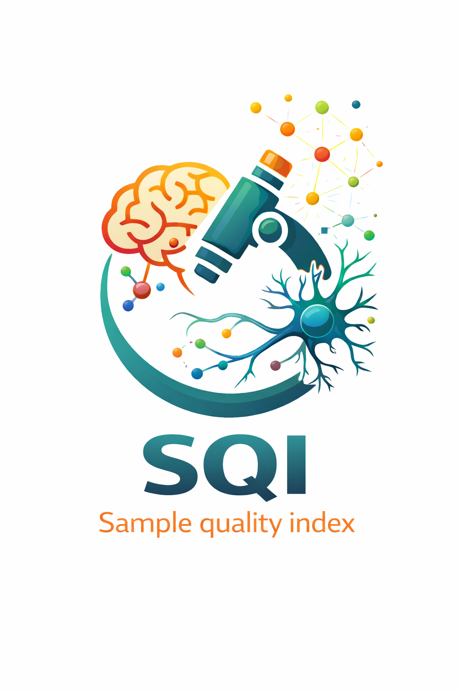

<p align="center">
  
</p>

---

# SQI – imaging-based sample quality control for smFISH

**SQI (Sample Quality Index)** is a modular, image-derived quality control (QC) framework for
**smFISH and MERFISH spatial transcriptomics data**.

Unlike molecule-level chemistry or probe-centric pipelines, SQI focuses on **biological sample–level
integrity**, quantifying RNA quality, spatial signal structure, and tissue organization directly
from imaging features.

<p align="center">
  
  
  
</p>

---

## Overview

Imaging-based spatial transcriptomics experiments are highly sensitive to **sample preservation,
RNA integrity, and tissue handling**. While existing pipelines emphasize spot calling, decoding,
and cell segmentation, there is limited support for **quantitative, sample-level QC** prior to
downstream biological interpretation.

SQI addresses this gap by providing a **modular QC stack** that operates directly in image space,
enabling:

- early identification of low-quality or compromised samples
- comparison of RNA quality across samples and experiments
- reproducible, interpretable QC metrics at both **dataset** and **cell** levels

---

## Key design principles

- **Sample-level first**  
  QC metrics are defined at the biological sample level, rather than individual FOVs or spots.

- **Imaging-native**  
  All metrics are computed from image-derived features (spots, masks, spatial structure).

- **Modular and extensible**  
  Each QC component can be enabled, disabled, or replaced independently.

- **Method-agnostic**  
  Compatible with multiple spot-calling, segmentation, and imaging platforms.

---

## QC modules (high level)

| Module | Description |
|------|------------|
| Tissue / foreground detection | Construction of tissue-aware valid masks |
| Spot statistics | Density, intensity, and spatial consistency |
| Cell-level aggregation | Per-cell RNA signal quality metrics |
| Spatial structure | Local clustering and neighborhood coherence |
| Dataset summary | Sample-level SQI scores and diagnostics |

---

## Quickstart

```bash
# create environment (example)
conda create -n sqi python=3.11 -y
conda activate sqi

pip install -r requirements.txt

python run_sqi.py
