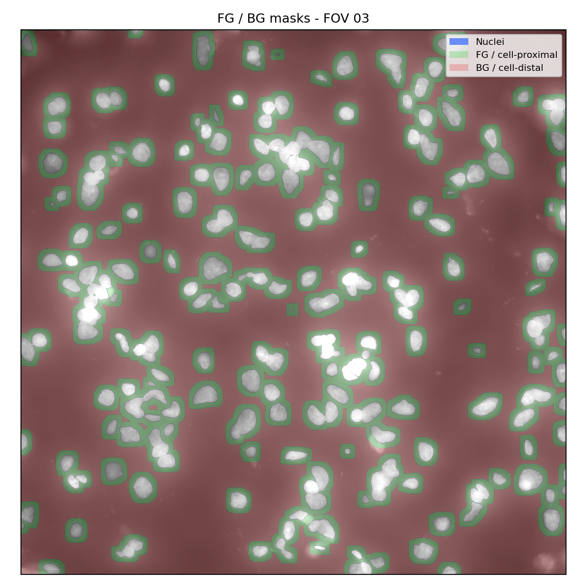
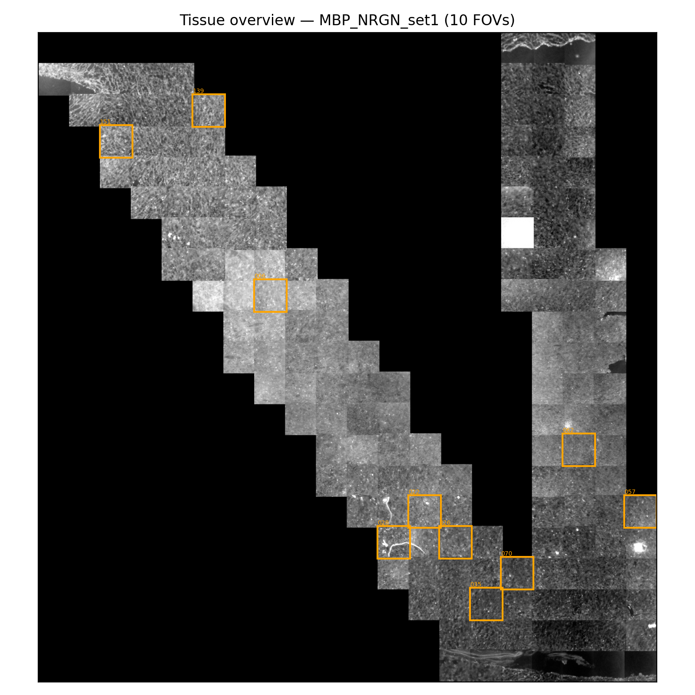
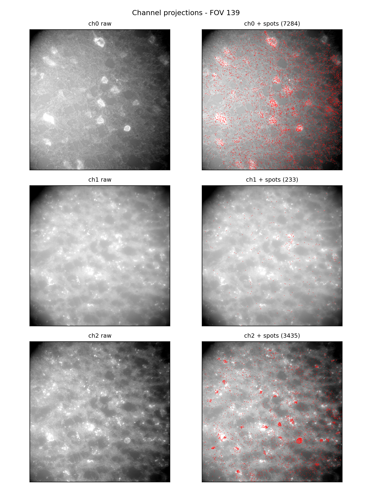
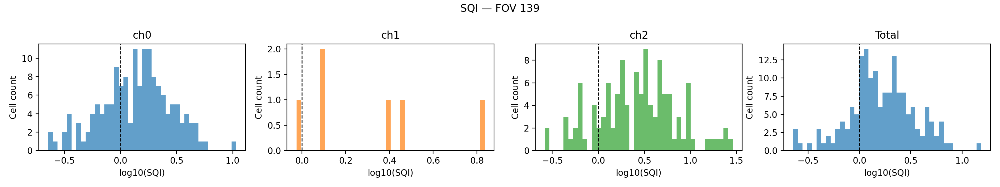

# SQI — Sample Quality Index for smFISH

<p align="left">
  
  
</p>

A lightweight QC toolkit that scores **sample-level RNA integrity** in smFISH spatial transcriptomics, directly from images.

## The problem

Most spatial transcriptomics pipelines focus on downstream spot calling, decoding, and segmentation — but the starting point - whether the **biological sample** is any good is still judged by eye. SQI replaces that with a single, reproducible number.

**Human control (smFISH) — good separation:**

<p align="center">
  
  
</p>

## What it measures

For each cell, SQI computes a signal-to-noise ratio:

```
SQI(cell) = weighted_spot_density(cell-proximal) / weighted_spot_density(cell-distal)
```

- **SQI >> 1** → high quality RNA concentrates near cells → good sample
- **SQI ≈ 1** → RNA diffusely spread with low quality → likely degraded

Per-cell scores are aggregated to a FOV-level summary. A built-in null model (assume uniform distributed-spots) validates that the metric is capturing real signal, not noise.

**Scope:** designed for sparse-to-moderate density tissues. In very dense tissues (e.g. mouse brain), foreground/background separation breaks down — and SQI will tell you so automatically (see [Reliability check](#reliability-check) below).

## Pipeline (Overview)

DAPI image
  → Cellpose segmentation
  → FG/BG mask construction

Per-channel pixel signal
  → Spotiflow spot detection
  → per-spot quality scoring
  (parallel across channels)

→ SQI computation
→ sanity checks


Everything runs from a single script. Intermediate results are cached.

## Quickstart

```bash
conda create -n sqi python=3.11 -y && conda activate sqi
pip install -e .

# GPU PyTorch (CUDA 12.1) — after pip install to avoid conflicts
conda install pytorch torchvision torchaudio pytorch-cuda=12.1 -c pytorch -c nvidia --solver=libmamba
```

### Check tile orientation first

Different microscopes may rotate tiles differently. Run this once per dataset to pick the correct `--rot_k` value (0–3):

```bash
python scripts\test_mosaic_orientation.py ^
  --data_fld C:\path\to\parent_folder ^
  --out orientation_test.png
```

### Run on a single FOV

```bash
python scripts\run_sqi_from_fov_zarr.py ^
  --fov_zarr  C:\path\to\fov.zarr ^
  --data_fld  C:\path\to\parent_folder ^
  --cache_root C:\path\to\cache ^
  --out_root   C:\path\to\output
```

### Run a batch
Run a batch randomly selects `n_fovs` FOVs from the data folder and runs the full SQI pipeline independently on each.

```bash
python scripts\run_batch_fovs.py ^
  --data_fld   C:\path\to\parent_folder ^
  --cache_root C:\path\to\cache ^
  --out_root   C:\path\to\output ^
  --n_fovs 10 ^
  --rot_k 1 ^
  --seed 42
```

## Outputs

Each FOV produces a self-contained QC report:

| File | What it is |
|------|------------|
| `sqi_summary.json` | FOV-level median SQI, per-channel breakdown, sanity AUC, reliability flag |
| `sqi_per_cell.csv` | Per-cell SQI and FG/BG spot counts |
| `sqi_per_cell_per_channel.csv` | Per-cell SQI broken down by RNA channel |
| `tissue_overview.png` | Low-res tissue mask with current FOV highlighted |
| `channel_projections.png` | Side-by-side raw image vs. raw + detected spots, per channel |
| `masks_overlay.png` | DAPI with nuclei, FG (cell-proximal), and BG (cell-distal) regions overlaid |
| `sqi_distribution.png` | log₁₀(SQI) histograms per channel + total |
| `sqi_sanity_check.png` | Real vs null SQI distribution overlay |

### Example outputs

Example QC reports from **human Frontotemporal Dementia (FTD)** cases.  
Each example shows the 3 per-FOV QC report images:
tissue overview, per-channel projections with spots, masks overlay.

<p align="center">
  
  
</p>
<p align="center">
  
</p>
## Reliability check

Not every tissue is suitable for FG/BG-based QC. SQI includes a built-in reliability check using the sanity-check AUC — the separation between real spot SQI and null (uniformly sampled) SQI.

- **AUC ≥ 0.6** → `sqi_reliable: true` — FG/BG separation holds, SQI scores are meaningful
- **AUC < 0.6** → `sqi_reliable: false` — pipeline prints a warning:

```
WARNING: FG/BG separation insufficient for this FOV (AUC=0.53), SQI may not be informative.
```
**Mouse brain (6-OHDA) — dense tissue, SQI unreliable:**

<p align="center">
  
  
</p>

This typically happens when tissue is too dense for a clear background region to exist (e.g. mouse brain), or when the sample is severely degraded. The flag is reported in `sqi_summary.json` so batch-level analysis can filter accordingly.

<p align="center">
  
</p>

In the example above, human control tissue (AUC ~0.7) passes reliably, while human FTD (disease-affected, AUC ~0.55) and mouse brain (high density, AUC ~0.55) are flagged — for different biological reasons, but with the same practical consequence: SQI scores on those FOVs should be interpreted with caution.

## Project structure

```
sqi/
  io/              — image & spots I/O (tiff, zarr, parquet)
  qc/              — FG/BG masks, SQI metrics, sanity check, plots
  spot_calling/    — Spotiflow backend
  spot_features/   — per-spot feature extraction & quality scoring
segmentation/      — Cellpose backend
scripts/           — run pipelines
configs/           — configuration files
```

## Dependencies

numpy · scipy · scikit-image · matplotlib · tifffile · zarr · cellpose · spotiflow · pandas · pyarrow
